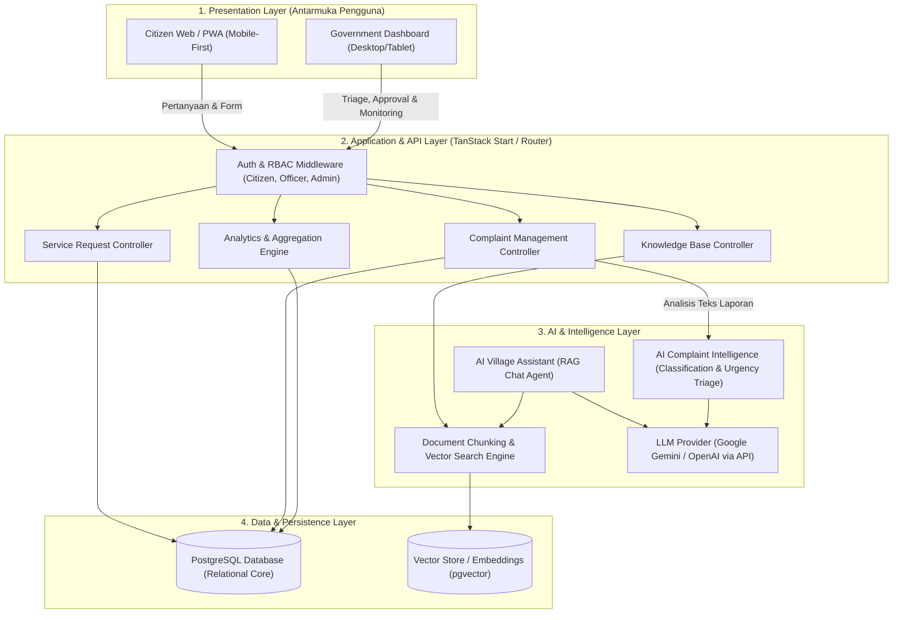
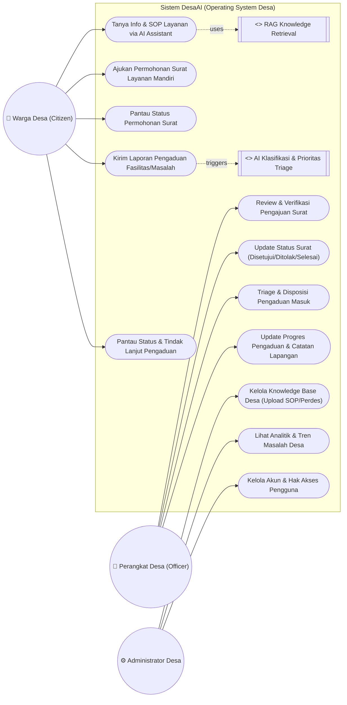
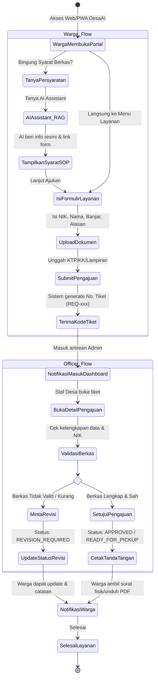
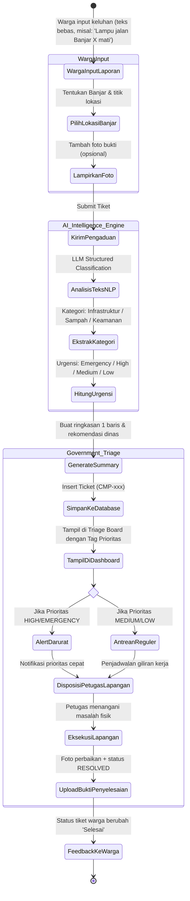

# System Architecture & Diagrams
## DesaAI — AI-Powered Operating System for Smart Villages

Dokumen ini memuat arsitektur sistem, **Use Case Diagram**, dan **Activity Diagram** untuk alur utama sistem DesaAI sesuai dengan proposal APTIKOM Hackathon 2026.

---

## 1. High-Level System Architecture

---

## 2. Use Case Diagram

Sistem DesaAI memiliki 3 aktor utama:
1. **Warga Desa (Citizen)**: Mengakses informasi, mengajukan permohonan surat layanan, dan melapor pengaduan.
2. **Perangkat Desa (Village Officer)**: Melakukan triage pengaduan, verifikasi berkas pengajuan surat, dan memperbarui status tiket.
3. **Administrator Desa (Admin)**: Mengelola master data, mengunggah SOP/dokumen ke Knowledge Base desa, dan memantau analitik desa.

---

## 3. Activity Diagram 1: Pengajuan Layanan Surat Digital

Alur aktivitas pengajuan layanan mandiri oleh warga hingga verifikasi oleh perangkat desa:

---

## 4. Activity Diagram 2: Pengaduan Warga & AI Triage Intelligence

Alur pengaduan warga dari pelaporan bebas hingga otomatisasi klasifikasi AI dan tindak lanjut petugas di lapangan:

---

## 5. Ringkasan Keunggulan Alur
1. **Zero Confusion**: Warga tidak perlu bingung memilih dinas atau SOP karena diarahkan oleh AI Village Assistant berbasis dokumen resmi.
2. **Automated Triage**: Petugas kantor desa tidak perlu membaca ribuan laporan secara manual dari awal; AI langsung menyajikan kategori, tingkat keparahan, dan ringkasan eksekutif.
3. **Accountability**: Setiap permohonan dan keluhan tercatat dengan nomor registrasi unik dan jejak status yang tidak bisa dimanipulasi.
