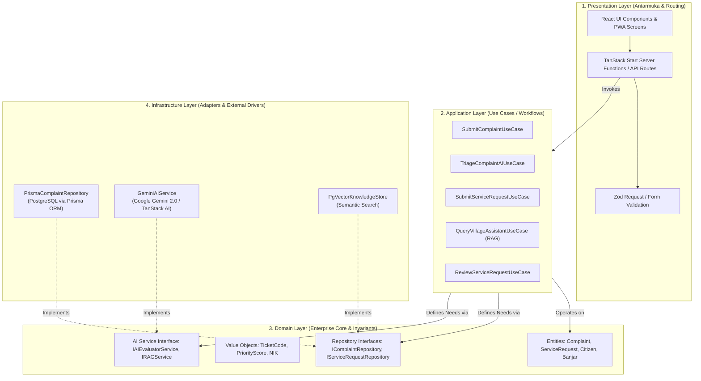

# Clean Architecture & Design Principles
## DesaAI — AI-Powered Operating System for Smart Villages

Dokumen ini mendefinisikan implementasi **Clean Architecture (Onion Architecture)** pada sistem DesaAI untuk menjamin kode modular, *loosely coupled*, mudah diuji (*testable*), dan siap dikembangkan dalam skala enterprise lintas tim.

---

## 1. Prinsip Utama Clean Architecture

Sesuai prinsip Robert C. Martin (Uncle Bob), **The Dependency Rule** mewajibkan bahwa dependensi kode hanya boleh mengarah ke dalam (*inward*):

```
       ┌────────────────────────────────────────────────────────┐
       │   Presentation / Frameworks & Drivers (TanStack Start) │
       │   ┌────────────────────────────────────────────────┐   │
       │   │   Infrastructure / Adapters (Prisma, Gemini)   │   │
       │   │   ┌────────────────────────────────────────┐   │   │
       │   │   │   Application / Use Cases (Workflows)  │   │   │
       │   │   │   ┌────────────────────────────────┐   │   │   │
       │   │   │   │   Domain / Enterprise Entities │   │   │   │
       │   │   │   └────────────────────────────────┘   │   │   │
       │   │   └────────────────────────────────────────┘   │   │
       │   └────────────────────────────────────────────────┘   │
       └────────────────────────────────────────────────────────┘
```

1. **Independensi Framework**: Inti logika bisnis desa (aturan surat, klasifikasi, prioritas) tidak bergantung pada TanStack Start, Express, atau framework web lainnya.
2. **Independensi Basis Data**: Logika use-case tidak terikat dengan Prisma atau PostgreSQL; perpindahan database cukup mengganti implementasi adapter *repository*.
3. **Independensi AI Provider**: Layanan AI diabstraksikan melalui interface `IAIService`, sehingga penggantian provider (Google Gemini, OpenAI, Claude, atau Ollama lokal) tidak merusak use-case aplikasi.
4. **Testability**: Use-case dapat diuji secara unit-testing tanpa perlu menyalakan database atau memanggil API AI eksternal yang berbayar (menggunakan *mock repository*).

---

## 2. Diagram Alur Layer & Dependency Inversion



---

## 3. Struktur Direktori Proyek (`src/`)

Arsitektur Clean Architecture dipetakan ke dalam direktori `src/` dengan hierarki berikut:

```text
src/
├── domain/                      # [LAYER 1: DOMAIN - Murni TypeScript, Zero Dependencies]
│   ├── entities/                # Entitas bisnis utama
│   │   ├── citizen.entity.ts
│   │   ├── complaint.entity.ts
│   │   ├── service-request.entity.ts
│   │   └── knowledge-doc.entity.ts
│   ├── value-objects/           # Value object bernilai kekal (immutable)
│   │   ├── nik.vo.ts            # Validasi 16 digit NIK
│   │   └── ticket-code.vo.ts    # Format kode REQ-xxx / CMP-xxx
│   └── repositories/            # Kontrak interface abstraksi data & AI
│       ├── i-complaint.repository.ts
│       ├── i-service-request.repository.ts
│       └── i-ai-evaluator.service.ts
│
├── application/                 # [LAYER 2: APPLICATION - Use Cases & Orkestrasi Bisnis]
│   ├── dtos/                    # Data Transfer Objects & Schema Input/Output
│   │   ├── complaint.dto.ts
│   │   └── service-request.dto.ts
│   └── use-cases/               # Use Case satuan logika aksi
│       ├── submit-complaint.use-case.ts
│       ├── triage-complaint-ai.use-case.ts
│       ├── submit-service-request.use-case.ts
│       ├── update-service-status.use-case.ts
│       └── ask-village-assistant.use-case.ts
│
├── infrastructure/              # [LAYER 3: INFRASTRUCTURE - Implementasi Nyata External]
│   ├── db/                      # Database Prisma Client connection
│   │   └── prisma-client.ts
│   ├── repositories/            # Implementasi konkrit dari domain/repositories
│   │   ├── prisma-complaint.repository.ts
│   │   └── prisma-service-request.repository.ts
│   └── ai/                      # Adapter AI & RAG
│       ├── gemini-evaluator.service.ts
│       └── rag-vector.service.ts
│
└── presentation/                # [LAYER 4: PRESENTATION - UI & Entry Points]
    ├── routes/                  # File-based routes TanStack Start
    ├── components/              # Komponen React (Citizen Portal & Gov Dashboard)
    │   ├── citizen/             # Form laporan, chat bubble warga, status tracker
    │   ├── government/          # Triage board, approval modal, analytics chart
    │   └── ui/                  # Primitif UI (Button, Input, Badge, Dialog)
    └── hooks/                   # Custom React hooks
```

---

## 4. Contoh Implementasi Dependency Inversion

### 4.1 Interface di Domain Layer (`src/domain/repositories/i-complaint.repository.ts`)
```typescript
import type { ComplaintEntity } from '../entities/complaint.entity'

export interface IComplaintRepository {
  findById(id: string): Promise<ComplaintEntity | null>
  findByTicketCode(ticketCode: string): Promise<ComplaintEntity | null>
  create(complaint: ComplaintEntity): Promise<ComplaintEntity>
  updateStatus(id: string, status: string, notes?: string): Promise<void>
  listRecent(limit?: number): Promise<ComplaintEntity[]>
}
```

### 4.2 Use Case di Application Layer (`src/application/use-cases/submit-complaint.use-case.ts`)
```typescript
import type { IComplaintRepository } from '../../domain/repositories/i-complaint.repository'
import type { IAIEvaluatorService } from '../../domain/repositories/i-ai-evaluator.service'
import type { CreateComplaintDTO } from '../dtos/complaint.dto'

export class SubmitComplaintUseCase {
  constructor(
    private readonly complaintRepo: IComplaintRepository,
    private readonly aiEvaluator: IAIEvaluatorService,
  ) {}

  async execute(dto: CreateComplaintDTO) {
    // 1. Jalankan evaluasi cerdas AI (kategori & urgensi)
    const aiEvaluation = await this.aiEvaluator.evaluateComplaintText(
      dto.title,
      dto.description,
    )

    // 2. Simpan keluhan dan hasil triage AI ke database melalui repository
    const createdComplaint = await this.complaintRepo.create({
      ...dto,
      category: aiEvaluation.category,
      priority: aiEvaluation.priority,
      aiSummary: aiEvaluation.summary,
    })

    return createdComplaint
  }
}
```

### 4.3 Implementasi di Infrastructure Layer (`src/infrastructure/repositories/prisma-complaint.repository.ts`)
```typescript
import type { IComplaintRepository } from '../../domain/repositories/i-complaint.repository'
import { prisma } from '../db/prisma-client'

export class PrismaComplaintRepository implements IComplaintRepository {
  async create(complaint: any) {
    return prisma.complaint.create({
      data: complaint,
    })
  }
  // Implementasi metode lainnya...
}
```

---

## 5. Keuntungan untuk Tim Hackathon

1. **Pembagian Tugas Paralel**:
   - Developer 1: Merancang Use Cases & Domain Rules di `src/application` dan `src/domain`.
   - Developer 2: Membangun UI Citizen & Admin di `src/presentation` menggunakan mock data.
   - Developer 3: Mengintegrasikan Prisma Database & LLM Engine di `src/infrastructure`.
   Ketiganya tidak akan saling menimpa (*merge conflict*) karena dipisahkan oleh *Interface Contracts*.
2. **Kesiapan Demo**: Jika kuota LLM habis atau offline saat latihan presentasi, use case cukup di-inject dengan `MockAIService` tanpa perlu mengubah baris kode UI sedikitpun!
